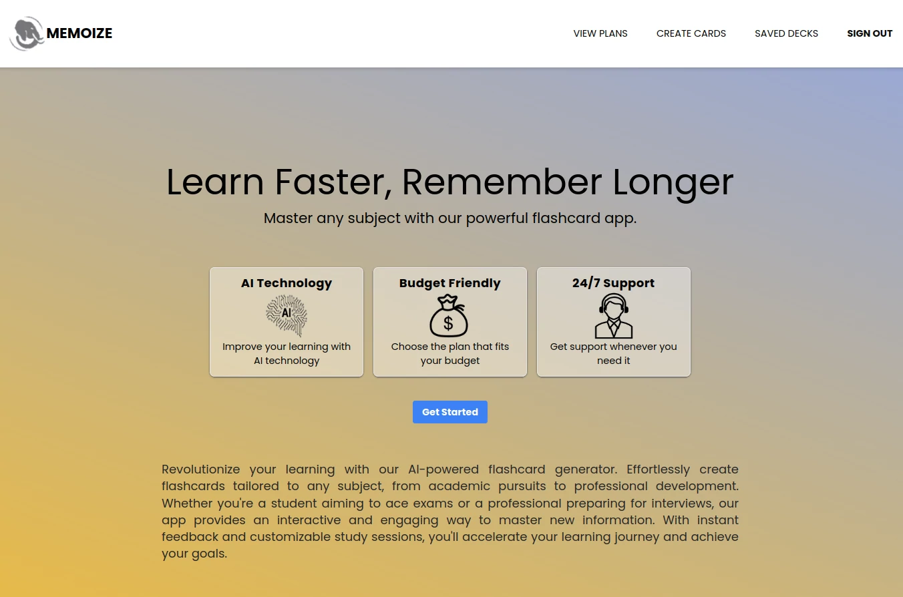
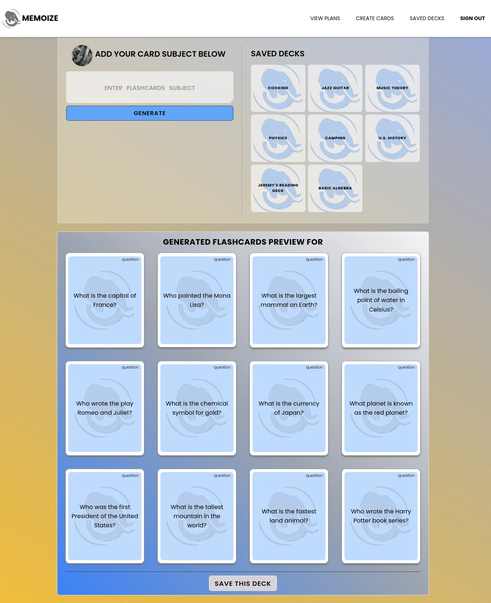
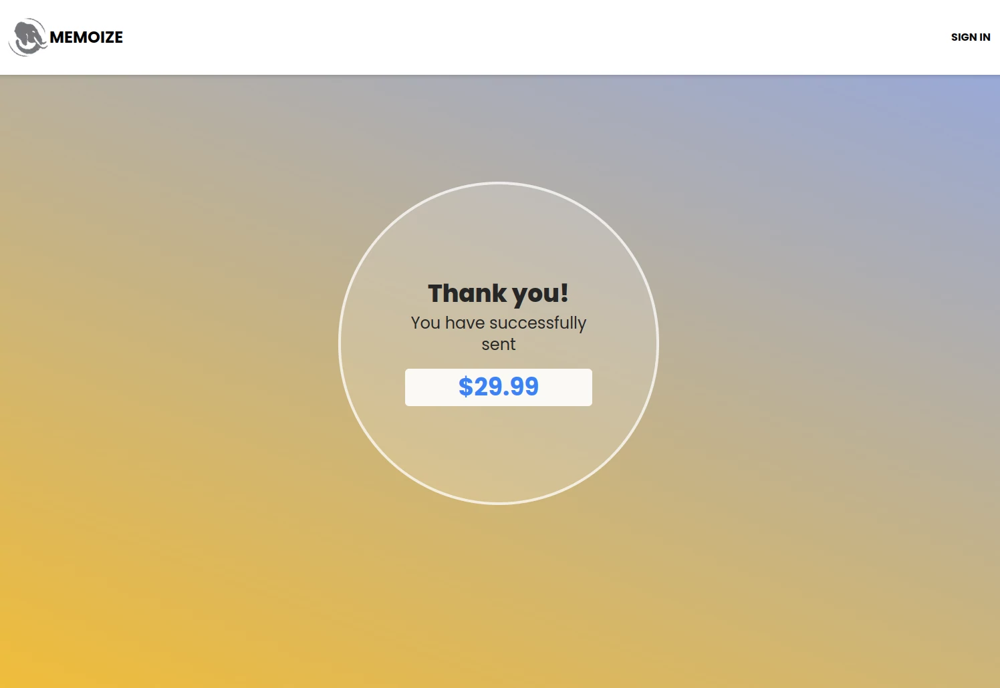

# Memoize - A Flashcard Creator

## Description

Memoize is project 4 of my fellowship with Headstarters. This application uses OpenAI which is given a System Prompt to use specific search parameters. Users can log on using Next Auth's Google Provider, create 12 flashcards at a time by simply typing in what subject they are wanting to study, save the sets to a Firestore Database, and (soon to come), pay for 1 of 3 plans offered on a 3 tiered platform. Payments will be accepted through the Stripe Software. As of now Stripe is loaded and functioning in a development environment.

## Usage

```bash
npm run dev
```

Open [http://localhost:3000](http://localhost:3000) with your browser to see the result.

This project uses [`next/font`](https://nextjs.org/docs/basic-features/font-optimization) to automatically optimize and load Poppins, a custom Google Font.

## Deployed on Vercel

Visit Memoize [here](https://headstarter-p2-pantry-tracker.vercel.app/),
or on [my website](http://www.williamlowrimore.com)






## Technologies Used

- [Next.js](https://nextjs.org)
- [NextAuth](https://nextauth.com)
- [TailwindCSS](https://tailwindcss.com)
- [Open AI](https://platform.openai.com)
- [Langchain](NPM)
- [Stripe](https://stripe.com)
- [React Icons](NPM)

## Resources

- [NextJS Docs](https://https://nextjs.org/docs)
- [Next Auth Docs](https://https:nextauth.com/docs)
- [Stripe Docs](https://docs.stripe.com)
- [Google Docs](https://docs.google.com)
- [OpenAI Docs](https://platform.openai/docs)
- [Codeium AI](https://codeium.com)
- [Gemini AI](https://gemini.google.com)
- Personal Docs

## Contact

- [wlowrimore@gmail.com](mailto://wlowrimore@gmail.com)
- [github/wlowrimore](https://github.com/wlowrimore)
- [williamlowrimore.com](http://williamlowrimore.com)
- [linkedIn/william-lowrimore-dev](https://linkedin.com/in/william-lowrimore-dev)
